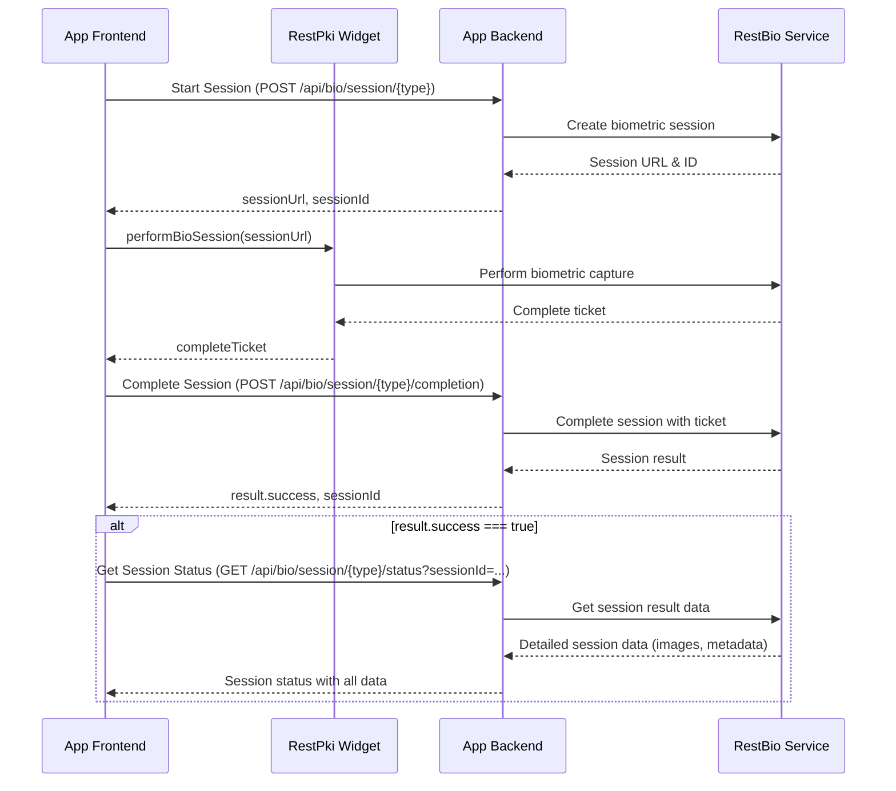

# RestBio Samples

This repository contains sample projects demonstrating the usage of Lacuna Software's
**Biometric APIs/SDKs** in various programming languages and frameworks.

**To get started, choose a backend programming language:**

* [.NET](backend/dotnet/)

**Then, choose a frontend programming language:**

* [Angular](frontend/angular/)

## Application flow

## See also

* [PKI Suite demos](https://demos.lacunasoftware.com/)
* [Documentation](https://docs.lacunasoftware.com/)
* [Lacuna Software website](https://www.lacunasoftware.com/)
